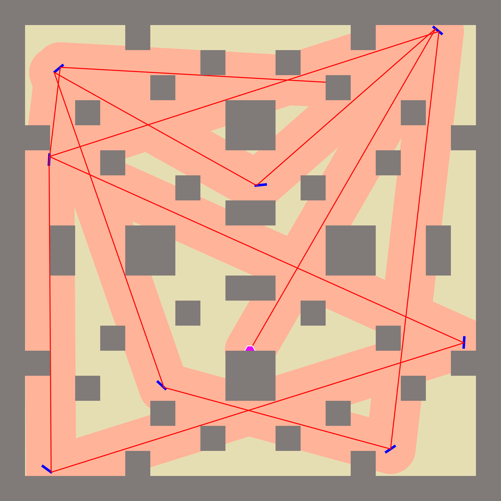

## CMC 2024

Tim: Mirror Force

Voditelj tima i glavni programer: Marko Srpak

Antonia Turković

Tin Vranaričić

Matea Vnučec

Natjecanje objavljeno: https://www.fer.unizg.hr/zpm/cmc24

Rezultati natjecanja: https://www.fer.unizg.hr/zpm/cmc23/o_pakiranjima

Naše konačno rješenje: 5. mjesto - 72.3435784313725 %

Potrebno verzija minGW koja je napisana ovdje https://www.sfml-dev.org/download/sfml/2.6.1/ za SFML GCC 13.1.0 MinGW (DW2) - 32-bit
nesto slično ovom (https://github.com/niXman/mingw-builds-binaries/releases/tag/13.1.0-rt_v11-rev1)

Pokrenuti sa make ili direktno copy-paste naredbu iz makefile dokumenta.

Preuzet julia sa stranice, za skidanje svih paketa
julia
import Pkg; Pkg.add("FileIO")
import Pkg; Pkg.add("ImageIO")
import Pkg; Pkg.add("Measures")
import Pkg; Pkg.add("Plots")
import Pkg; Pkg.add("UUIDs")
